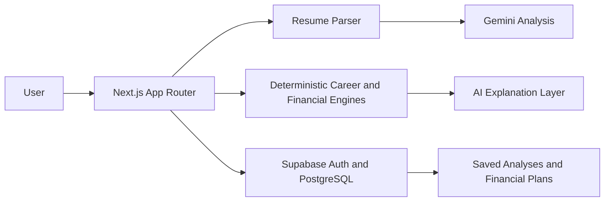

# LifeOS

**Decision intelligence for your career, life goals, and financial future.**

[](https://life-os-mvp-beta.vercel.app/)
[](https://nextjs.org/)
[](https://supabase.com/)
[](https://ai.google.dev/)

**Live application:** [https://life-os-mvp-beta.vercel.app/](https://life-os-mvp-beta.vercel.app/)

LifeOS turns a resume into a connected five-year decision plan. It helps users understand how AI may change their work, identify resilient career paths, prepare for target roles, and determine whether those career paths can fund important life events.

> Most products plan careers and finances separately. LifeOS connects them.

## Product Overview

LifeOS guides users through one continuous journey:

`Resume → Career → Life → Scenario → Investment → Report`

1. **Understand the user:** Parse a PDF, DOCX, or TXT resume and identify skills, gaps, achievements, and career signals.
2. **Assess AI impact:** Separate tasks likely to be automated from skills worth augmenting and human capabilities worth strengthening.
3. **Compare career paths:** Recommend roles using readiness, salary potential, transition difficulty, and AI resilience.
4. **Plan life events:** Create an editable timeline for goals such as education, relocation, a home purchase, or custom milestones.
5. **Build an investment plan:** Convert life events into prioritized financial goals and calculate their monthly funding requirements.
6. **Take action:** Produce a combined decision report and tailor the resume against a real job description.

## Why LifeOS Is Different

- **Career-to-corpus planning:** Shows how a selected career path changes the user's projected five-year corpus.
- **Human + AI career strategy:** Focuses on tasks AI may replace, work AI can augment, and strengths that remain distinctly human.
- **Life-event-driven investing:** Financial goals originate from the user's actual timeline instead of generic savings targets.
- **Evidence-backed resume tailoring:** Rewrites resume content against a job description without inventing unsupported experience.
- **Deterministic financial calculations:** AI explains the plan, but does not control or alter the underlying numbers.
- **One guided experience:** Users do not need to re-enter life events when moving into financial planning.

## Core Features

### Career Intelligence

- Resume parsing for PDF, DOCX, and TXT files up to 10 MB
- ATS and career-health assessment
- Technical skills, soft skills, and skill-gap detection
- AI exposure and resilient-strength analysis
- AI-resilient role suggestions
- 30-day, 90-day, and 12-month upskilling roadmap
- Five-year career scenario comparison

### Resume Tailoring

- Import or paste a job description
- Match supported and missing keywords
- Generate evidence-backed rewrites
- Highlight unsupported requirements
- Build a tailored role-specific resume

### Life And Financial Planning

- Editable chronological life-event timeline
- Preset and custom financial goals
- INR-based projections
- Inflation-adjusted goal costs
- Required and allocated monthly investments
- Goal feasibility and priority waterfall
- Broad strategy-category guidance
- Current career path versus selected career path comparison
- AI-generated educational explanation

### Accounts And Persistence

- Supabase magic-link authentication
- Row Level Security for user-owned records
- Save, reopen, update, and delete financial plans
- Draft recovery after authentication
- Dashboard access to saved plans

## Recommended Demo Flow

For a concise product demonstration:

1. Open the [live application](https://life-os-mvp-beta.vercel.app/) and start a plan.
2. Upload a sample resume and review the AI-impact assessment.
3. Select a target career direction and role.
4. Add or edit life events and essential financial inputs.
5. Choose a career scenario and continue into the automatically prefilled investment timeline.
6. Compare the current and selected career paths.
7. Finish on the combined decision report.
8. Open Resume Tailoring and compare the resume with a job description.

## Architecture



LifeOS keeps calculations and AI responsibilities separate:

- Resume and career analysis use AI with deterministic demo fallbacks.
- Financial projections use tested TypeScript calculation functions.
- Gemini explains calculated financial results but cannot modify them.
- Supabase RLS ensures users can access only their own stored records.

## Technology Stack

| Layer | Technology |
| --- | --- |
| Framework | Next.js 14 App Router, React 18, TypeScript |
| Styling | Tailwind CSS, shadcn/ui, Radix UI |
| Motion and icons | Framer Motion, Lucide React |
| AI | Google Gemini, optional Anthropic/OpenAI packages |
| Authentication and database | Supabase Auth, PostgreSQL, Row Level Security |
| Resume parsing | `pdf-parse`, `mammoth` |
| Email | Resend |
| Testing | Vitest, Testing Library |
| Deployment | Vercel |

## Local Development

### Prerequisites

- Node.js 20 or newer
- npm
- A Supabase project
- A Gemini API key for live AI analysis

### Installation

```bash
git clone https://github.com/maheshcalib/careerlens.git
cd careerlens
npm install
```

Create `.env.local`:

```env
AI_PROVIDER=gemini
GEMINI_API_KEY=
GEMINI_MODEL=gemini-2.5-flash-lite

NEXT_PUBLIC_SUPABASE_URL=
NEXT_PUBLIC_SUPABASE_ANON_KEY=
# Optional alternative for newer Supabase projects:
NEXT_PUBLIC_SUPABASE_PUBLISHABLE_KEY=
SUPABASE_SERVICE_ROLE_KEY=

ANTHROPIC_API_KEY=
OPENAI_API_KEY=
RESEND_API_KEY=
NEXT_PUBLIC_APP_URL=http://localhost:3000
NEXT_PUBLIC_DEMO_MODE=true
```

Apply the Supabase migrations in order:

```text
supabase/migrations/001_initial.sql
supabase/migrations/002_financial_plans.sql
```

Configure the Supabase authentication redirect URL:

```text
http://localhost:3000/auth/callback
```

Then start the application:

```bash
npm run dev
```

Open [http://localhost:3000](http://localhost:3000).

## Available Scripts

```bash
npm run dev        # Start the development server
npm run build      # Create a production build
npm run start      # Run the production build
npm run lint       # Run Next.js ESLint checks
npm test           # Run the Vitest suite
npm run test:watch # Run tests in watch mode
```

## Main Application Routes

| Route | Purpose |
| --- | --- |
| `/` | Product homepage |
| `/journey` | Unified six-stage guided journey |
| `/life-planning` | Career-to-corpus planner and saved-plan editor |
| `/tailor` | Job-description-based resume tailoring |
| `/dashboard` | Career overview and saved financial plans |
| `/login` | Supabase magic-link authentication |

## Data Model

The Supabase schema stores:

- `users`: profile and plan level
- `analyses`: resume text and structured analysis results
- `life_plans`: life-event planning records
- `financial_plans`: plan inputs, assumptions, career path, results, and AI explanation
- `financial_goals`: normalized goals belonging to a financial plan

All user-owned tables use Row Level Security policies.

## Responsible Use

- Financial outputs are educational projections, not financial advice.
- Returns, salary growth, and inflation values are editable assumptions, not guarantees.
- LifeOS recommends broad strategy categories, not named investment products.
- AI-generated resume changes should be reviewed before use.
- Resume tailoring is designed to preserve evidence and avoid fabricated experience.

## Deployment

LifeOS is deployed on Vercel:

**[https://life-os-mvp-beta.vercel.app/](https://life-os-mvp-beta.vercel.app/)**

For a new Vercel deployment:

1. Import the GitHub repository into Vercel.
2. Add the environment variables listed above.
3. Set `NEXT_PUBLIC_APP_URL` to the production domain.
4. Add the production `/auth/callback` URL to Supabase Auth redirect URLs.
5. Deploy using the default Next.js build configuration.

## Product Vision

LifeOS is designed to evolve from a career-planning tool into a personal decision-intelligence system: one place where users can evaluate career moves, AI disruption, skill investments, life milestones, and long-term financial readiness before making consequential decisions.

